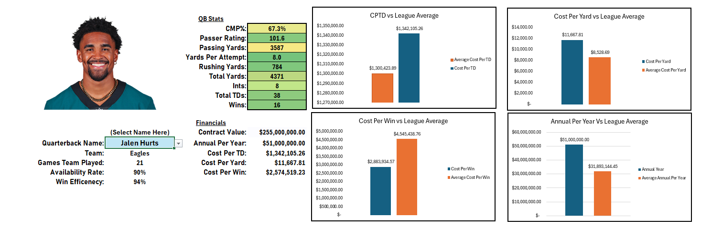

Project Overview

This project analyzes quarterback contracts in the National Football League by comparing player salary with performance metrics to evaluate whether top-paid quarterbacks deliver value relative to their peers.
---------------------
Background

The project was initially created to evaluate whether Jalen Hurts provides contract value relative to other quarterbacks receiving top-tier salaries. The analysis tests this hypothesis by comparing quarterback performance metrics against contract value across players in similar salary tiers.

(GO BIRDS!)
---------------------
Objective:

Determine whether highly paid quarterbacks deliver performance proportional to their salary relative to their peers.
---------------------
Data & Metrics:

The analysis compares - Quarterback salary, Total (Passing and rushing) yards, Touchdowns, Efficiency ratings, Cost-per-performance metrics
----------------------
Tools Used:

Software

Microsoft Excel

Excel Tools

Data Validation – Created dropdown menus to dynamically select quarterbacks.

Charts & Graphs – Used bar charts to compare QB financial efficiency vs league averages.

Conditional Formatting – Highlighted performance relative to league averages (above/below average).

Interactive Dashboard Design – Built a visual dashboard displaying player stats, financial metrics, and comparisons.

Pivot Tables – Used for summarizing and aggregating player statistics.

Excel Functions / Formulas

XLOOKUP – Retrieved player statistics, team data, and financial metrics dynamically.

INDEX / MATCH – Used for advanced lookups across multiple conditions (e.g., QB vs specific opponent).

IF statements – Created logic for performance comparisons and efficiency calculations.

AVERAGE – Calculated league averages for benchmarking.

SUM / SUMIF – Aggregated player statistics and totals.

Custom Financial Formulas – Calculated metrics such as:

Cost per Win

Cost per Yard

Cost per Touchdown

Adjusted Cost per Win (penalizing losses and availability)

Win Efficiency

Availability Efficiency

Data Analysis Techniques

Performance benchmarking vs league averages

Salary-to-performance financial modeling

Sports analytics performance evaluation

Data visualization and dashboard reporting
-----------------------------------------

